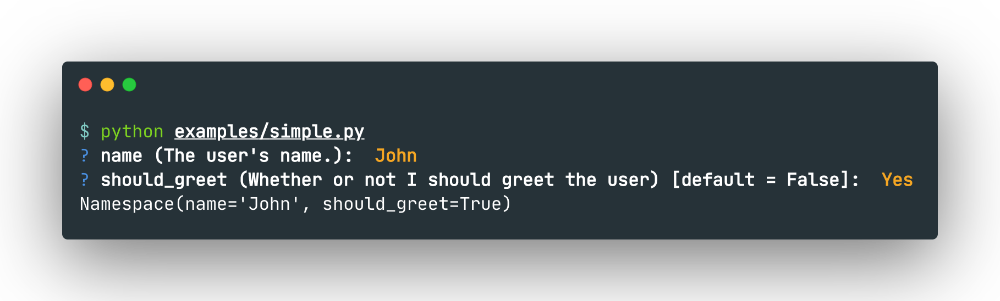

# InteractiveArgparse


## Table of Contents

* [Installation](#installation)
* [Getting Started](#getting-started)
* [Usage](#usage)
* [Features](#features)
* [Prompters](#prompters)

## Installation
To install, run
```shell script
pip install InteractiveArgparse
```

## Getting Started

You can wrap your existing `ArgumentParser` with an `InteractiveArgumentParser` like so:
```python
import argparse
from interactive_argparse import InteractiveArgumentParser

def main():
    parser = argparse.ArgumentParser()
    parser.add_argument("--name", help="The user's name.")
    parser.add_argument("--should_greet", help="Whether or not I should greet the user", action="store_true")

    iparser = InteractiveArgumentParser(parser)
    args = iparser.parse_args()
    print(args)


if __name__ == "__main__":
    main()
```

Running this script without arguments results in interactive prompts like so:



## Prompters

Terminal prompts are just the default — `InteractiveArgumentParser` can be pointed at a completely different interactive flow via its `prompter` argument, including an auto-generated web form (`WebPrompter`) or your own custom `Prompter` subclass.

See [docs/prompters.md](docs/prompters.md) for how to use the built-in web prompter and how to write your own.

## Development

### Running tests

To run all tests:
```shell
python -m pytest
```

## Contributing

We welcome early adopters and contributors to this project! See the [Contributing](CONTRIBUTING.md) section for details.

## License

This project is open-sourced under the MIT license. See [LICENSE](LICENSE.md) for details.
